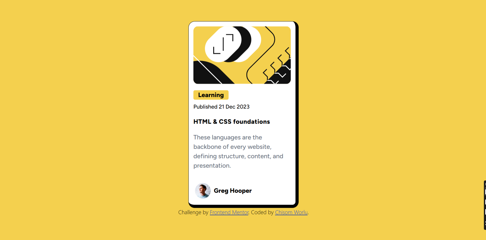

# Frontend Mentor - Blog preview card solution

This is a solution to the [Blog preview card challenge on Frontend Mentor](https://www.frontendmentor.io/challenges/blog-preview-card-ckPaj01IcS). Frontend Mentor challenges help you improve your coding skills by building realistic projects. 

## Table of contents

- [Overview](#overview)
  - [The challenge](#the-challenge)
  - [Screenshot](#screenshot)
  - [Links](#links)
  - [What I learned](#what-i-learned)
- [Author](#author)

## Overview
A Blog preview card built with **HTML5** and **Tailwind CSS**. This project was created as part of my frontend mentor challenge to improve layout structure and flex.I added add focus states for all interactive elements.

### The challenge

Users should be able to:

- See hover and focus states for all interactive elements on the page

### Screenshot

### Links

- Live Site URL: [Live here](https://blog-preview-card-fawn-pi.vercel.app/)
### Built with

- Semantic HTML5 markup
- Tailwind CSS
- Flexbox (for layout)
-Depolyed with  Vercel

## Author

- Linkdlin - [Chisom Worlu](https://www.linkedin.com/in/chisomworlu)
- Frontend Mentor - [@Chisomworlu12](https://www.frontendmentor.io/profile/Chisomworlu12)
- Twitter - [@chisomwo](https://www.twitter.com/chisomwo)

